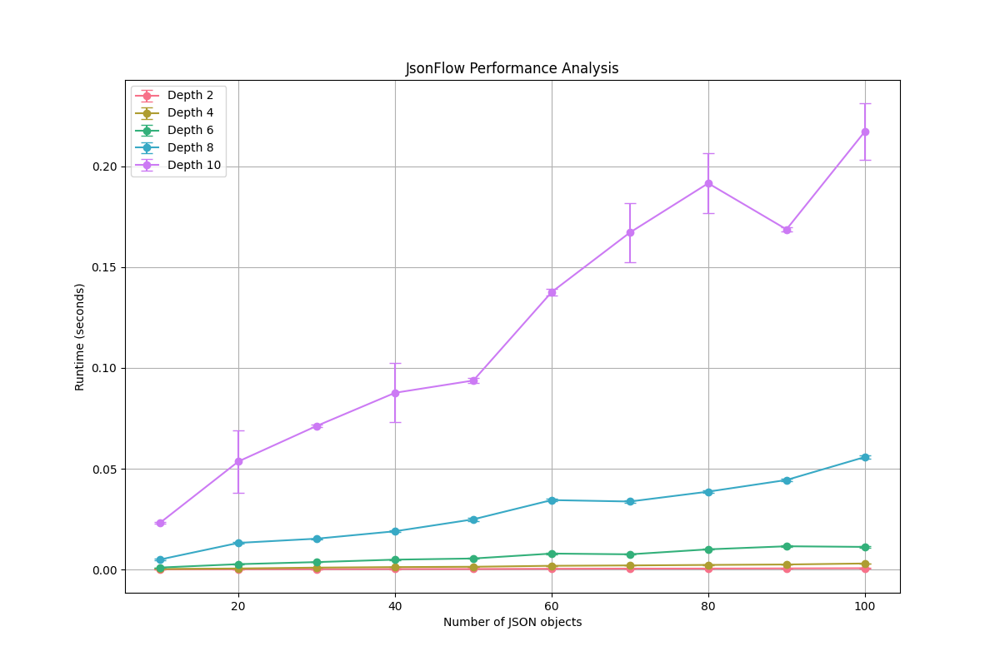

# JSON Flow

A streaming JSON parser, designed to parse incomplete JSON streams from LLM outputs in real-time, providing access to the current parsed state at any moment.

## Features

- Streaming parse of JSON data
- Support for partial and incomplete JSON structures
- Comprehensive error handling
- Support for arrays, objects, and nested structures
- Handles whitespace and special characters
- Unicode support

## Algorithm Complexity

The JSON stream parser's complexity can be analyzed by its key operations:

### Time Complexity

1. **Consume Operation**: O(n)
   - Appending to chunks: O(1) amortized
   - Validation of brace/bracket count: O(n)
   - Parsing operation: O(n)

2. **Get Operation**: O(1)
   - return the string parsed

### Space Complexity

1. **Instance Storage**: O(n)
   - chunks list: O(n) for storing partial JSON strings
   - current_valid_json: O(n) for the latest valid JSON string

2. **Parsing Operations**: O(1)
   - All parsing operations use constant extra space

### Recursion

The parser uses recursion to handle nested structures. The depth of the recursion is determined by the depth of the JSON structure being parsed. For deep nested json files, it might raise a stack overflow runtime error.

## Installation

JSON Flow requires Python 3.11 or later. The project uses `uv` for dependency management.

### uv

```bash
# Create a virtual environment and install dependencies
uv venv
source .venv/bin/activate
uv sync
```

### venv
```bash
python -m venv .venv
pip install -r requirements-dev.txt
```
```bash
# For development, install additional dependencies
pip install -r requirements-dev.txt
```

## Usage Examples

### Basic Usage

```python
from stream_parser import StreamJsonParser

# Initialize the parser
parser = StreamJsonParser()

# Parse a complete JSON object
parser.consume('{"name": "John", "age": 30}')
result = parser.get()
print(result)  # '{"name": "John", "age": 30}'

# Parse a complete JSON array
parser.consume('[1, 2, 3, 4]')
result = parser.get()
print(result)  # '[1, 2, 3, 4]'
```

### Handling Partial JSON

```python
# Initialize the parser
parser = StreamJsonParser()

# Receive partial JSON data
parser.consume('{"user": "alice", "data": [1, 2')
# At this point, no complete JSON is available
print(parser.get())  # None

# Receive more data
parser.consume(', 3, 4]}')
# Now we have a complete JSON
result = parser.get()
print(result)  # '{"user": "alice", "data": [1, 2, 3, 4]}'
```

### Error Handling

```python
from stream_parser import StreamJsonParser, StreamParserJSONDecodeError

parser = StreamJsonParser()

try:
    # Try to parse invalid JSON
    parser.consume('{"invalid": }')
except StreamParserJSONDecodeError as e:
    print(f"Error parsing JSON: {e}")

# Handle multiple root elements (not allowed)
try:
    parser.consume('{}{}')  # Two root objects
except StreamParserJSONDecodeError as e:
    print(f"Error: Multiple root elements are not allowed - {e}")
```

For more examples and detailed usage, check the test suite in `tests/test_stream_parser.py`.

## Development

### Running Tests

#### pytest

```bash
# Run all tests
pytest

# Run tests with coverage
pytest --cov=src
```

#### uv

```bash
# Run linter
uv run pytest
```

### Code Style

The project uses `ruff` for code formatting and linting:

```bash
make format
make lint
make lint_fix
```

## Project Structure

- `src/stream_parser.py`: Main parser implementation
- `src/config.py`: Configuration and logging setup
- `src/logger.py`: Logger configuration
- `tests/`: Test suite with comprehensive test cases

## Dependencies

- `pydantic`: Data validation using Python type annotations
- `pydantic-settings`: Settings management
- `python-dotenv`: Environment variable management
- `python-json-logger`: JSON-formatted logging

### Development Dependencies

- `pytest`: Testing framework
- `ruff`: Code formatting and linting

## Error Handling

The parser provides detailed error handling through custom exceptions:

- `StreamParserJSONDecodeError`: Base class for JSON parsing errors
- `PartialJSON`: Indicates incomplete JSON data
- `MalformedJSON`: Indicates invalid JSON format

## Performance

The `benchmarks` directory contains performance evaluation tools and results for the `StreamJsonParser` class. The main evaluation notebook `performance_evaluation.ipynb` measures parsing performance across different scenarios:

- **Data Complexity**: Tests JSON structures with varying depths (2, 4, 6, 8, 10 levels)
- **Data Volume**: Each depth is tested with increasing amounts of JSON objects (10 to 100)
- **Statistical Rigor**: Multiple runs per configuration to calculate mean, standard deviation, and confidence intervals

### Results

The performance analysis shows how parsing time scales with both JSON complexity (depth) and volume:



The benchmark notebook includes detailed statistical analysis including:
- Mean runtime per configuration
- Standard deviation
- 95% confidence intervals
- Visualization of performance trends

To run the benchmarks yourself, execute the Jupyter notebook in the `benchmarks` directory.